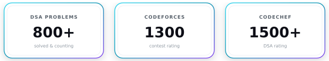
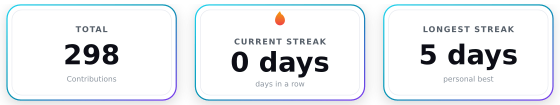

  

  

<h1 align="center">Hi, I'm Mohit Kumar 👋</h1>

  🔭 <strong>Full-Stack Developer · Distributed Systems, Backends & High-Throughput Pipelines</strong>

  Computer Science graduate from <strong>IIT Jodhpur</strong>, building from India 🇮🇳 
  I work on scalable backends and distributed applications — the kind where correctness under load matters more than demos.

  
  
  
  

---

## Tech Stack

  

  <strong>Languages</strong> · Java · Python · TypeScript · C++ · SQL &nbsp;│&nbsp; <strong>Backend &amp; Data</strong> · PostgreSQL · Redis · Kafka · System Design · REST APIs &nbsp;│&nbsp; <strong>Platform &amp; Frontend</strong> · AWS · Docker · React · FFmpeg

  Currently exploring distributed learning systems · high-throughput streaming · edge caching.

🤖 <strong>LLM Toolchain</strong>

  

  Agents + reusable Agent Skills for planning and implementation · I own direction, scope, and the final review.

---

## GitHub Activity

  <picture>
    <source media="(prefers-color-scheme: dark)" srcset="https://cdn.jsdelivr.net/gh/Zyrexam/Zyrexam@output/github-contribution-grid-snake-dark.svg" />
    <source media="(prefers-color-scheme: light)" srcset="https://cdn.jsdelivr.net/gh/Zyrexam/Zyrexam@output/github-contribution-grid-snake.svg" />
    
  </picture>

  Commits eat the dots — updated daily by <a href="./.github/workflows/snake.yml">snake.yml</a>.

🏆 <strong>Competitive Programming &amp; DSA</strong>

  

  

  Refreshed daily by <a href="./.github/workflows/streak.yml">streak.yml</a>.

---
## Publications

Peer-reviewed work with official publisher links:

- **FedMeet** — published at ACM. Read it here: [doi.org/10.1145/3772290.3772295](https://dl.acm.org/doi/10.1145/3772290.3772295)
- **AASC** — published at ScienceDirect. Read it here: [sciencedirect.com — S0304397526003208](https://www.sciencedirect.com/science/article/abs/pii/S0304397526003208)
- **Blockchain × LLM** — accepted, publisher link coming soon from the conference. I'll add the official URL here once it is live.

---

## Beyond the Code
- 🎓 **Cleared JEE Advanced** — graduated in Computer Science from IIT Jodhpur.
- 📄 **Published researcher** — FedMeet (ACM), AASC (ScienceDirect), plus Blockchain × LLM on the way.
- 🍵 **Tea over coffee, always** — best system designs happen over chai.
- 🔁 **Iterate until it's right** — I'll redraw an architecture five times to get the boundaries clean.

  Design for scale. Prove the edge cases. Ship what lasts.

